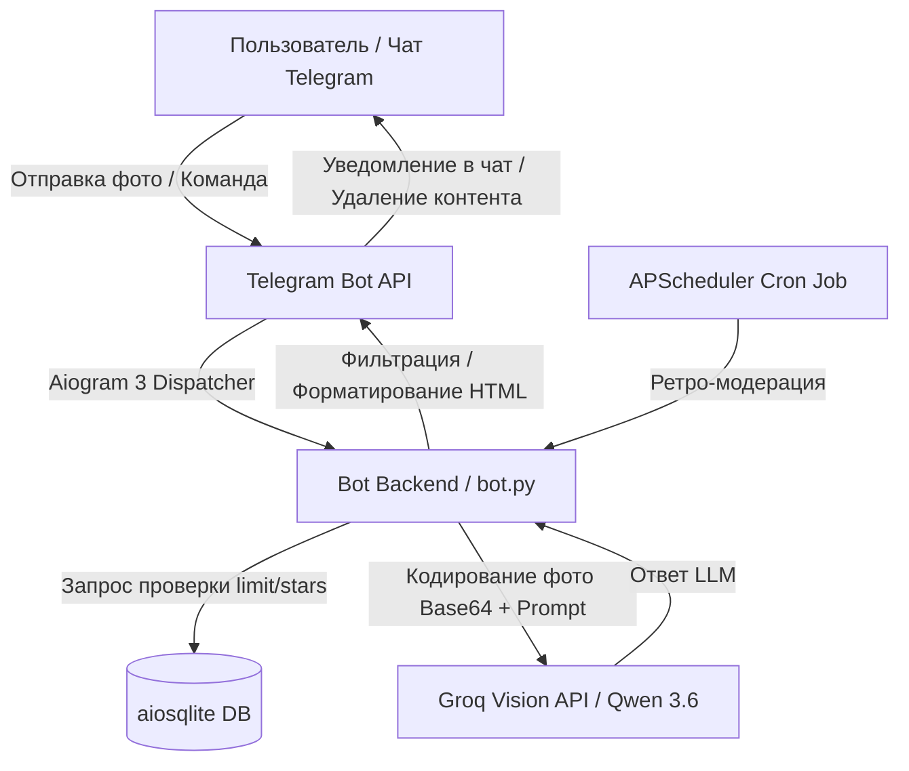

# 🤠 Telegram Meme Police Bot (`memes_for_friends`)

> **Умный AI-шериф для Telegram-чатов:** автоматическая модерация мемов, защита от токсичного контекста, генерация объяснений/прожарок мемов и встроенная монетизация через Telegram Stars.

[](https://www.python.org/)
[](https://docs.aiogram.dev/)
[](https://groq.com/)
[](https://sqlite.org/)

---

## 🎯 Бизнес-контекст и решаемая проблема

В активных комьюнити-чатах картинки и мемы составляют до 50% контента. Однако вместе с юмором в чат часто попадают:
1. **Токсичный или запрещенный политический контент**, провоцирующий конфликты.
2. **Сложные или узкоспециализированные мемы**, смысл которых понятен не всем участникам.
3. **Засорение чата** нерелевантными изображениями.

**Решение (`tg_meme_police`):**
ИИ-бот с персоной «Шерифа», который в реальном времени анализирует визуальный и текстовый контент изображений с помощью мультимодальной LLM (Vision Model), мгновенно фильтрует нарушение правил группы и повышает вовлеченность (engagement) участников за счет интерактивных AI-команд.

---

## ✨ Ключевые функции (Product Features)

### 🛡️ 1. AI-Модерация контента (Content Moderation)
- **Мультимодальный анализ изображений:** Распознавание текста на картинке, культурного контекста и персонажей.
- **Интеллектуальная фильтрация:** Отличает безобидный юмор и поп-культуру от агрессивного политического контекста.
- **Safe HTML & Fallback Retry:** Автоматический повтор запросов (exponential backoff) при лимитах API и надежная экранизация ответов.

### 🎭 2. Интерактивные AI-механики для пользователей
- **`/explain` (Поясни за мем):** ИИ разъясняет скрытый смысл, отсылки или контекст картинки.
- **`/roast` (Прожарка от Шерифа):** Ироничная оценка качества мема в фирменном стиле Шерифа.
- **`/vibe` (Vibe Check):** Оценка настроения и эмоционального фона изображения.

### ⏰ 3. «Машина Времени» (Retro Moderation Job)
- Фоновое периодическое сканирование архива группы (через `APScheduler`) для ретроспективной проверки случайных старых мемов.

### ⭐️ 4. Система лимитов и монетизация (Telegram Stars)
- **Дневные бесплатные лимиты:** Ограничение числа бесплатных проверок для защиты от спама.
- **Интеграция Telegram Stars:** Возможность покупки дополнительных проверок через нативный платежный шлюз Telegram.
- **Асинхронная БД (`aiosqlite`):** Учет ежедневных проверок и баланса звезд каждого пользователя.

---

## 🏗️ Архитектура системы



---

## 🛠️ Технологический стек

- **Язык программирования:** Python 3.12
- **Telegram Framework:** `aiogram 3.x` (Async IO)
- **AI / LLM Provider:** `AsyncGroq` API (`qwen/qwen3.6-27b` Vision)
- **База данных:** SQLite + `aiosqlite`
- **Планировщик задач:** `APScheduler`
- **Конфигурация:** `python-dotenv`

---

## 🚀 Быстрый запуск (Development Setup)

### 1. Клонирование и подготовка окружения
```bash
git clone https://github.com/IuliiaVy/memes_for_friends.git
cd memes_for_friends
python3 -m venv venv
source venv/bin/activate  # На Windows: venv\Scripts\activate
pip install -r requirements.txt
```

### 2. Переменные окружения (`.env`)
Создайте файл `.env` на основе `.env.example`:
```env
BOT_TOKEN=your_telegram_bot_token
GROQ_API_KEY=your_groq_api_key
CHANNEL_ID=@memes_for_friends_best
ADMIN_CHAT_ID=your_admin_chat_id
MAIN_GROUP_ID=your_main_group_id
```

### 3. Запуск бота
```bash
python bot.py
```

---

## 📄 Лицензия & Авторство

- **Автор:** [Iuliia Vy](https://github.com/IuliiaVy) — Business & Product Analyst.
- Проект разработан в образовательных и практических целях для демонстрации интеграции Telegram API, LLM и проектирования пользовательских сценариев.
